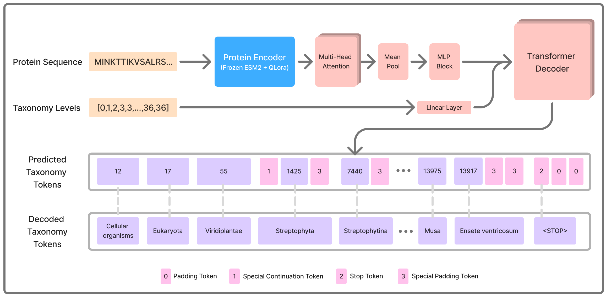

# TaxoFormer

**Predict a taxonomic lineage directly from a protein sequence.**

TaxoFormer fine-tunes the [ESM-2](https://github.com/facebookresearch/esm) protein language
model (650M) with a lightweight LoRA adapter and an autoregressive transformer decoder that
generates a full taxonomic path, from domain down to species, across 37 ranks, constrained
to a known taxonomy tree.

```
MGNKWSKGWPQIRERIRRTPPAAAEGVGAVSQDLDKHGAVTSSNMNNADNVWLRAQEEEEEVGF...   (an HIV-1 protein)
        │
        ▼
Viruses > Riboviria > Pararnavirae > Artverviricota > Revtraviricetes >
Ortervirales > Retroviridae > Orthoretrovirinae > Lentivirus > ...
```

---


## Architecture



A frozen, LoRA-adapted ESM-2 encoder embeds the sequence; attention pooling collapses it to one
vector, which an autoregressive decoder expands level-by-level into the lineage. Non-greedy methods
enforce a valid parent→child path (`parent_to_child_mapping.csv`) so every prediction is a legal tree.


## Install

```bash
git clone https://github.com/msparsa/taxoformer
cd taxoformer
pip install -r requirements.txt
pip install -e .
```

The base ESM-2 weights (`esm2_t33_650M_UR50D`) download automatically on
first use; the TaxoFormer delta (LoRA + pooling + decoder, ~300 MB) and the taxonomy assets come
from the Hub.

## Quickstart

```python
from taxoformer import TaxoFormer

model = TaxoFormer.from_pretrained("msparsa/taxoformer")   # or a local directory

seq = "MGNKWSKGWPQIRERIRRTPPAAAEGVGAVSQDLDKHGAVTSSNMNN..."
lineage = model.predict(seq, method="leaf_reconstruct")
print(" > ".join(lineage))
```

## Inference methods

All four share the same trained model; they differ only in how the lineage is decoded:

| method | description | always valid tree? |
|---|---|---|
| `greedy` | plain autoregressive argmax (fast baseline) | no |
| `min_edit` | greedy, then repair invalid parent→child edges to the nearest valid taxon | yes |
| `beam` | constrained beam search restricted to valid edges | yes |
| `leaf_reconstruct` | anchor on the model's deepest in-tree node, then reconstruct the canonical lineage to the root | yes |

```python
model.predict(seq, method="greedy")
model.predict(seq, method="min_edit")
model.predict(seq, method="beam")
model.predict(seq, method="leaf_reconstruct")   # default
```

### Confidence and top-K trees

Get a confidence score with any prediction, or return the top-K **valid** alternative trees:

```python
# single prediction + confidence (broad-placement confidence, 0..1)
model.predict(seq, method="leaf_reconstruct", return_confidence=True)
# -> {"lineage": [...], "confidence": 0.97}

# top-5 valid lineages via constrained beam search
for t in model.predict_topk(seq, k=5):
    print(t["confidence"], t["rel_prob"], " > ".join(t["lineage"]))
# each: {"lineage": [...], "logprob": ..., "confidence": 0..1, "rel_prob": softmax weight among the k}
```

`confidence` is the geometric-mean per-rank probability over the **broad ranks** (domain →
phylum/class), the part of the tree the model is informative about. It is positively correlated
with how much of the true lineage is recovered, but it is **not** a correctness
guarantee: short or novel proteins can be placed confidently but wrongly.

## Benchmark

Normalized Robinson–Foulds (RF) distance on **TreeFam** and **TreeBase** (lower is better, ↓).
TaxoFormer generates the lineage directly rather than building a tree from embeddings, and is
best on TreeBase while staying competitive on TreeFam.

| Model | Parameters | Evaluation method | TreeFam ↓ | TreeBase ↓ |
|---|---|---|---|---|
| Hamming distance | – | Embed → NJ\* | 0.7509 | 0.7466 |
| ESM-2 | 650M | Embed → NJ\* | 0.6669 | 0.7809 |
| ProGen2-XLarge | 6.4B | Embed → NJ\* | 0.8249 | 0.8624 |
| Evo 2 | 7B | Embed → NJ\* | 0.8406 | 0.8372 |
| PHYLA | 24M | Embed → NJ\* | **0.5777** | 0.7269 |
| **TaxoFormer (ours)** | 802M | **Direct lineage generation** | 0.7010 | **0.7240** |

<sub>\* Tree constructed from sequence embeddings via the Neighbor-Joining (NJ) algorithm.</sub>


## Limitations

Trust the broad path (domain → class) more than the species leaf, and treat `confidence` as a
broad-placement signal, not a correctness guarantee.

- **Partial training set** — trained on a ~30M-sequence subset, not the full ~400M corpus, so this
  is not the model's ceiling.
- **Sequence length** — trained only on sequences ≤ 300 aa; longer proteins still run (up to ESM-2's
  1022-residue limit) but are out of distribution, so accuracy may drop. 
- **Short / low-complexity proteins** — carry little phylogenetic signal and are the most likely to
  be confidently placed in the wrong superkingdom (often a short bacterial lineage).

## License & citation

If you use TaxoFormer in your research, please cite:

```bibtex
@article{Parsa2026.06.06.730618,
    author = {Parsa, Mohammad and Azimian, Kooshiar and Wei, Kathy Y.},
    title = {TaxoFormer: Hierarchical Transformer for Predicting the Full Taxonomic Lineage of Protein Sequences},
    elocation-id = {2026.06.06.730618},
    year = {2026},
    doi = {10.64898/2026.06.06.730618},
    publisher = {Cold Spring Harbor Laboratory},
    URL = {https://www.biorxiv.org/content/early/2026/06/09/2026.06.06.730618},
    eprint = {https://www.biorxiv.org/content/early/2026/06/09/2026.06.06.730618.full.pdf},
    journal = {bioRxiv}
}
```
